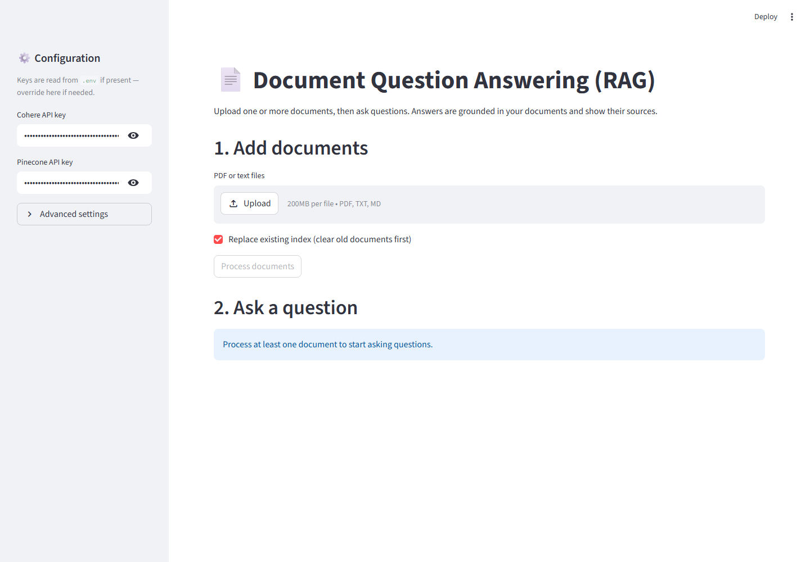
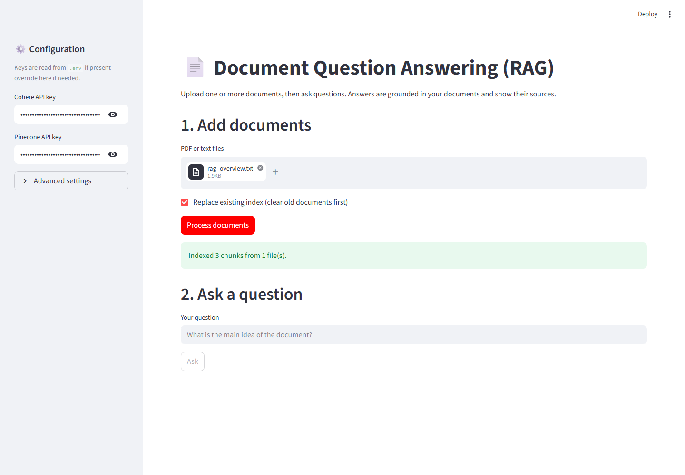
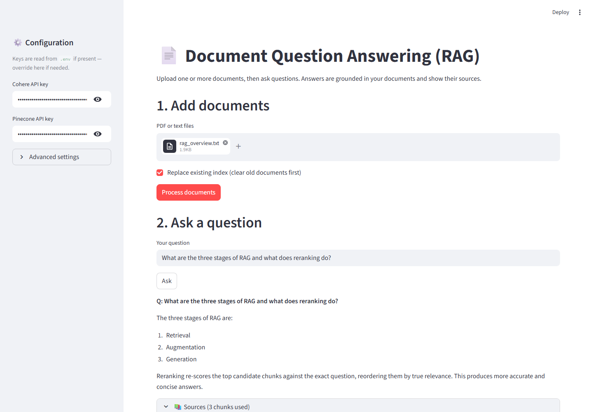

# 📄 Document Question Answering System (RAG)

A Retrieval-Augmented Generation (RAG) system that answers questions about your
own documents. Upload PDFs or text files, ask a question, and get an answer that
is **grounded in the document** and shows **exactly which passages it came from**.

Built with **Cohere** (embeddings, reranking, grounded chat) and **Pinecone**
(serverless vector database), wrapped in a **Streamlit** web app.

---

## Why this is more than a basic RAG

This implements the extras from the assignment's *"Improvements & Experiments"* list:

| Feature | What it does |
|---|---|
| **Recursive, overlapping chunking** | Splits on paragraph → sentence → word boundaries so chunks stay coherent, with overlap so context isn't lost at the seams. |
| **Two-stage retrieval + rerank** | Pulls `top_k` candidates by vector similarity, then reorders them with Cohere Rerank so only the *most relevant* chunks reach the model. |
| **Grounded answers with citations** | Answers are generated from retrieved documents and cite their sources; the UI lists every chunk used, with page numbers and relevance scores. |
| **Multi-document support** | Upload several files at once; each chunk keeps its source filename and page. |
| **Correct query/document embeddings** | Uses Cohere's `search_document` vs `search_query` input types for measurably better retrieval. |
| **Fully configurable** | Chunk size, overlap, `top_k`, and rerank count are adjustable from the sidebar. |

---

## Architecture

```
                ┌─────────────── INGEST ───────────────┐
  PDF / TXT ──► extract text (per page) ──► clean ──► recursive chunk (+overlap)
                                                            │
                                              Cohere embed (search_document)
                                                            │
                                                   Pinecone upsert  ◄── vectors + metadata

                ┌─────────────── ASK ──────────────────┐
  question ──► Cohere embed (search_query) ──► Pinecone similarity search (top_k)
                                                            │
                                              Cohere Rerank (keep best N)
                                                            │
                                      Cohere Chat with retrieved documents
                                                            │
                                          grounded answer + citations + sources
```

Each stage is a small, independently testable module:

```
rag-document-qa/
├── app.py                 # Streamlit UI
├── rag/
│   ├── config.py          # settings from .env / secrets / sidebar
│   ├── ingest.py          # PDF/text → cleaned, page-tagged, overlapping chunks
│   ├── embeddings.py      # Cohere embed wrapper (batched)
│   ├── vectorstore.py     # Pinecone create / upsert / query
│   ├── retriever.py       # vector search + Cohere rerank
│   ├── generator.py       # grounded Cohere Chat answer + citations
│   └── pipeline.py        # orchestrates ingest() and ask()
├── tests/                 # offline unit + pipeline tests (mocked SDKs)
├── sample_docs/           # a document you can try immediately
├── requirements.txt
├── .env.example
└── README.md
```

---

## Setup

### 1. Install dependencies

```bash
cd rag-document-qa
python -m pip install -r requirements.txt
```

### 2. Get free API keys

- **Cohere** — https://dashboard.cohere.com/api-keys (free trial keys available)
- **Pinecone** — https://app.pinecone.io/ → *API Keys* (free "Starter" tier)

### 3. Add your keys

Copy the example env file and fill it in:

```bash
cp .env.example .env      # Windows: copy .env.example .env
```

```
COHERE_API_KEY=your-cohere-key
PINECONE_API_KEY=your-pinecone-key
```

*(You can also paste the keys directly into the app sidebar at runtime.)*

---

## Run

```bash
streamlit run app.py
```

Then, in the browser (http://localhost:8501):

1. Upload one or more PDFs / text files (try `sample_docs/rag_overview.txt`).
2. Click **Process documents**.
3. Ask a question, e.g. *"What is the main idea of the document?"*
4. Read the answer and expand **Sources** to see the exact chunks it used.

---

## Screenshots

**1. Upload your documents**



**2. Documents chunked, embedded, and indexed**



**3. Grounded answer with the source chunks it used**



*(These are captured from a real run against Cohere + Pinecone — see
`scripts/capture_screenshots.py`.)*

---

## Testing

The core logic (chunking, config, and the full ingest→ask pipeline) is covered by
tests that **mock the Cohere and Pinecone SDKs**, so they run instantly with no
keys and no network:

```bash
python -m pytest -q
```

---

## Configuration reference

All settings have sensible defaults and can be set via env vars or the sidebar:

| Setting | Default | Meaning |
|---|---|---|
| `EMBED_MODEL` | `embed-multilingual-v3.0` | embedding model (1024-dim, multilingual) |
| `CHAT_MODEL` | `command-r-plus-08-2024` | answer-generation model |
| `RERANK_MODEL` | `rerank-v3.5` | reranking model |
| `CHUNK_SIZE` | `1000` | characters per chunk |
| `CHUNK_OVERLAP` | `150` | characters shared between neighbouring chunks |
| `TOP_K` | `20` | candidates fetched from Pinecone |
| `RERANK_TOP_N` | `5` | chunks kept after reranking (fed to the model) |
| `PINECONE_INDEX` | `rag-document-qa` | index name |
| `PINECONE_CLOUD` / `PINECONE_REGION` | `aws` / `us-east-1` | serverless location |

---

## How RAG works (the concept)

1. **Retrieval** — find the passages most relevant to the question using vector similarity.
2. **Augmentation** — add those passages to the model's prompt as context.
3. **Generation** — the language model writes an answer grounded in that context.

This keeps answers **factual** and lets the model answer over **private / custom
data** it was never trained on.

## Credits

Reference project: [VivekChauhan05/RAG_Document_Question_Answering](https://github.com/VivekChauhan05/RAG_Document_Question_Answering).
This implementation reworks it into a modular, tested package and adds reranking,
citations, multi-document support, and configurable chunking.
